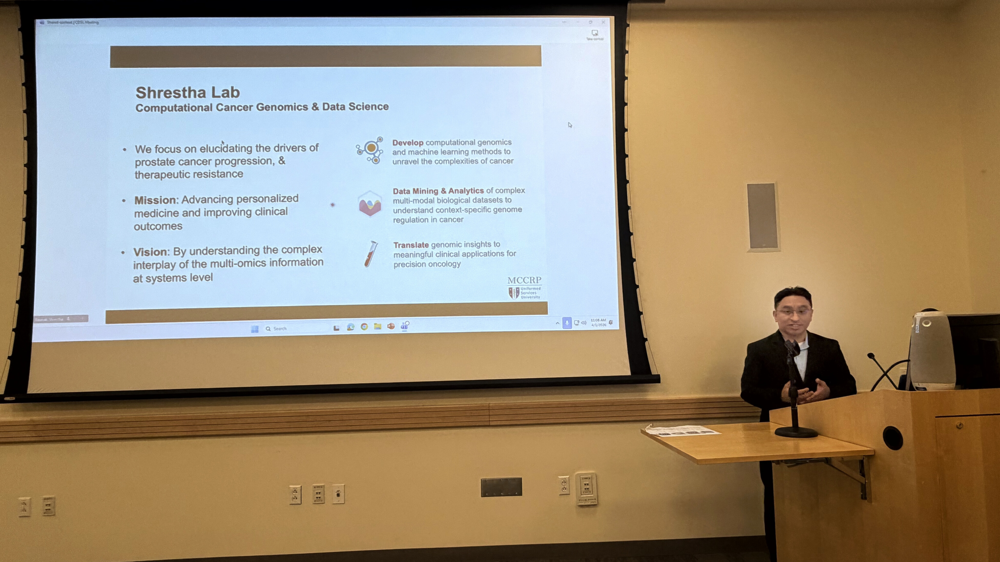
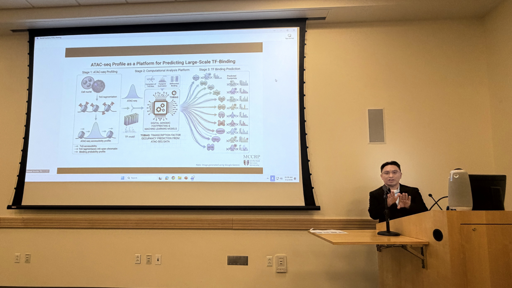

On April 1, 2026, Dr. Raunak Shrestha was a featured guest speaker at the Cancer Data Science Laboratory (CDSL) seminar series, hosted by the National Cancer Institute (NCI) in Bethesda, Maryland.

Dr. Shrestha presented his research focusing on the epigenomic architecture of metastatic prostate cancer. His presentation detailed how advanced computational and genomic approaches are uncovering the underlying regulatory mechanisms that drive cancer progression and treatment resistance. The seminar provided an invaluable platform to share these insights with leading federal cancer researchers and fostered exciting discussions on future collaborative efforts in therapeutic discovery.

